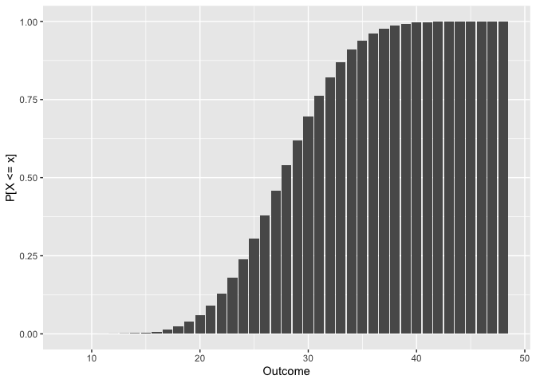
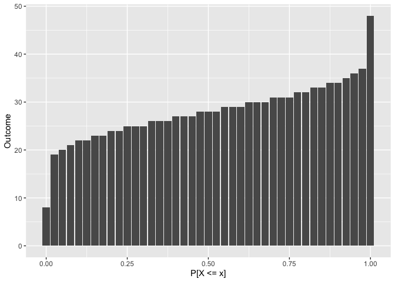

<!-- README.md is generated from README.Rmd. Please edit that file -->

# droll <a href='https://curso-r.com/'></a>

<!-- badges: start -->

[](https://lifecycle.r-lib.org/articles/stages.html#experimental)
<!-- [](https://CRAN.R-project.org/package=droll) -->
[](https://github.com/curso-r/droll/actions)
[](https://codecov.io/gh/curso-r/droll?branch=master)
<!-- badges: end -->

## Overview

**droll** \\ˈdrōl\\ *adjective*. **1**. having a humorous, whimsical, or
odd quality.

droll is an R package for parsing dice notation, analyzing rolls,
calculating success probabilities, and plotting outcome distributions.
It can help detail-oriented DMs prepare (un)fair encounters in advance
or decide on skill check DCs on the fly. Players might also find it
useful for determining the best course of action when in a tough
situation.

It is designed to be a very lightweight (only one required dependency),
very fast (less than 0.4s to get the full distribution of 40d6), and
very precise (symbolic internal representation courtesy of Ryacas)
[anydice](https://anydice.com/) for R.

## Installation

Install the released version of droll from CRAN with:

``` r
install.packages("droll")
```

Or install the development version from GitHub with:

``` r
# install.packages("remotes")
remotes::install_github("curso-r/droll")
```

## Usage

What are you looking for in droll? Are you a level 1 user, a seasoned
level 10 programmer, or a god-like level 20 statistician? Choose your
class:

### 🖍️ User

The most basic usage of droll involves simply rolling dice. You can
create any die you want with the `d()` function and then write an
expression that involves that die. Note that, if you want to roll NdX,
you should write `N * dX`.

``` r
# Create some dice
d20 <- d(20)
d6  <- d(6)
d4  <- d(4)

# Roll a skill check while blessed
(d20 + 8) + d4
#> [1] 26

# Roll for damage!
8 * d6
#> [1] 17

# Dexterity saving throw with disadvantage
if (min(d20, d20) + 4 < 18) {
  print("Full damage!")
} else {
  print("Half damage.")
}
#> [1] "Full damage!"
```

Nice and easy, right? If you are a DM, you might also want to use two
functions: `check_prob()` and `check_dc()`. They allow you to,
respectively, calculate the probability of passing (or failing) a skill
check and find the necessary DC so a skill check has a given probability
of success (or failure). You don’t even need to create the dice you’re
going to use inside these two!

``` r
# What's the probability of this player succeeding in a DC 15 skill check?
check_prob(d20 + 8, 15)
#> [1] 0.7

# What should the DC be for this player to have a 50% chance of success?
check_dc(d20 + 8, 0.5)
#> [1] 19

# What's the probability of this player failing in a DC 10 skill check?
check_prob(d20 + 8, 10, success = FALSE)
#> [1] 0.05

# What should the DC be for this player to have a 90% chance of failure?
check_dc(d20 + 8, 0.9, success = FALSE)
#> [1] 27
```

There are no `attack_*()` functions because the mechanics of checks and
attacks is the same, i.e., success means rolling a value higher than or
equal to a certain threshold. These functions can, therefore, be used
for attacks too!

### 🗡️ Programmer

If you are already used to R’s d/p/q/r notation, you might want to get
deeper insights into the roll distribution. This is why the `droll()`,
`proll()`, `qroll()`, and `rroll()` functions exist! They are,
respectively, the density, the distribution function, the quantile
function, and the random generation for the distribution described by a
roll expression.

``` r
# P[d20 + 8 = 12]
droll(12, d20 + 8)
#> [1] 0.05

# P[d20 + 8 <= 12]
proll(12, d20 + 8)
#> [1] 0.2

# inf{x: P[d20 + 8 <= x] >= 0.5}
qroll(0.5, d20 + 8)
#> [1] 18

# Draw 3 simulations from d20 + 8 
rroll(3, d20 + 8)
#> [1] 14 24 18
```

Once you know how to use these four functions, you can look for their
`plot_*()` variations. They generate plots (using ggplot2 if it’s
available) corresponding to the full distributions of d/p/q and a simple
histogram in the case of `plot_rroll()`.

``` r
# Density of 8d6
droll_plot(8 * d6)
```


``` r
# Distribution function of 8d6
proll_plot(8 * d6)
```



``` r
# Quantile function of 8d6
qroll_plot(8 * d6)
```



``` r
# Histogram of 1000 rolls of 8d6
rroll_plot(1000, 8 * d6)
```


Every p/q function also has a convenient `lower.tail` argument that can
be set to `FALSE` in order to run calculations from the upper tail of
the distribution.

### 🪄 Statistician

Since you are an R veteran, you should be able to bend droll to your
will. If you’d like to peek into the fabric of droll’s reality, you can
use the `r()` function to get a full roll distribution. If you want
maximum precision, you can also stop droll from casting its internal
representation (powered by Ryacas) to doubles with `precise = TRUE`.

``` r
# Get full distribution of 8d6
r(8 * d6)
#> # A tibble: 41 × 4
#>    outcome     n           d           p
#>      <dbl> <dbl>       <dbl>       <dbl>
#>  1       8     1 0.000000595 0.000000595
#>  2       9     8 0.00000476  0.00000536 
#>  3      10    36 0.0000214   0.0000268  
#>  4      11   120 0.0000714   0.0000982  
#>  5      12   330 0.000196    0.000295   
#>  6      13   792 0.000472    0.000766   
#>  7      14  1708 0.00102     0.00178    
#>  8      15  3368 0.00201     0.00379    
#>  9      16  6147 0.00366     0.00745    
#> 10      17 10480 0.00624     0.0137     
#> # … with 31 more rows

# Unlimited power
r(8 * d6, precise = TRUE)
#> # A tibble: 41 × 4
#>    outcome n     d          p           
#>      <dbl> <chr> <chr>      <chr>       
#>  1       8 1     1/1679616  1/1679616   
#>  2       9 8     1/209952   1/186624    
#>  3      10 36    1/46656    5/186624    
#>  4      11 120   5/69984    55/559872   
#>  5      12 330   55/279936  55/186624   
#>  6      13 792   11/23328   143/186624  
#>  7      14 1708  427/419904 2995/1679616
#>  8      15 3368  421/209952 707/186624  
#>  9      16 6147  683/186624 695/93312   
#> 10      17 10480 655/104976 11495/839808
#> # … with 31 more rows
```

The data frame returned by `r()` can be used as the `roll` argument of
every function discussed above. This skips all internal calculations, so
it’s a useful shortcut if you want to run multiple diagnostics on the
same roll expression.

As a level 20 statistician, you are not constrained by droll’s built-in
dice either. You can create custom dice using the same `d()` function
described before.

``` r
# Create a fudge die
dF <- d(-1:1)
rroll(5, dF)
#> [1]  1 -1  1 -1 -1

# Create a 2d20kh, the "advantage die"
df <- r(max(d20, d20))
kh <- d(rep(df$outcome, df$n))
rroll(5, kh)
#> [1] 20 11 16 20  8
```

## Code of Conduct

Please note that the droll project is released with a [Contributor Code
of
Conduct](https://contributor-covenant.org/version/2/0/CODE_OF_CONDUCT.html).
By contributing to this project, you agree to abide by its terms.
